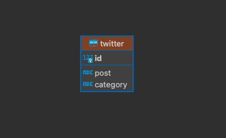

# Desafio: CRUD com Análise de Sentimentos do Twitter

## Descrição
Este projeto é um sistema CRUD que permite criar, ler, atualizar e deletar dados, integrado com uma funcionalidade de análise de sentimentos de tweets. Ele utiliza um banco de dados SQLite para armazenar informações relacionadas ao Twitter e oferece uma análise de sentimentos sobre os dados coletados.

## Tecnologias Utilizadas
- Python
- SQLite
- Bibliotecas Python: SQLAlchemy (para ORM), outras bibliotecas para análise de sentimentos (a especificar)

## Tabela de dados


## Dados inseridos na base
| id | post                                    | category |
|----|-----------------------------------------|----------|
| 1  | I love Python! Is the best programming language! | Positive |
| 2  | I Dont like others programming languages        | Negative |
| 3  | Python is really                        | Neutral  |


## Instalação e Execução
Para instalar e executar o projeto, siga estes passos:

```bash
# Clone o repositório
git clone https://github.com/natanielpaiva/gran-python.git

# Instale as dependências
pip install -r requirements.txt # (criar este arquivo se não existir)

# Execute o arquivo principal
python main.py
